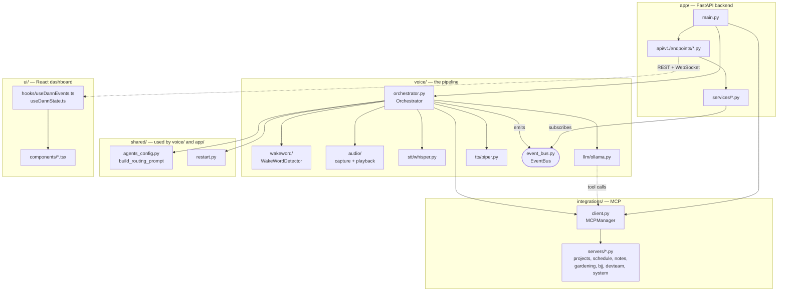
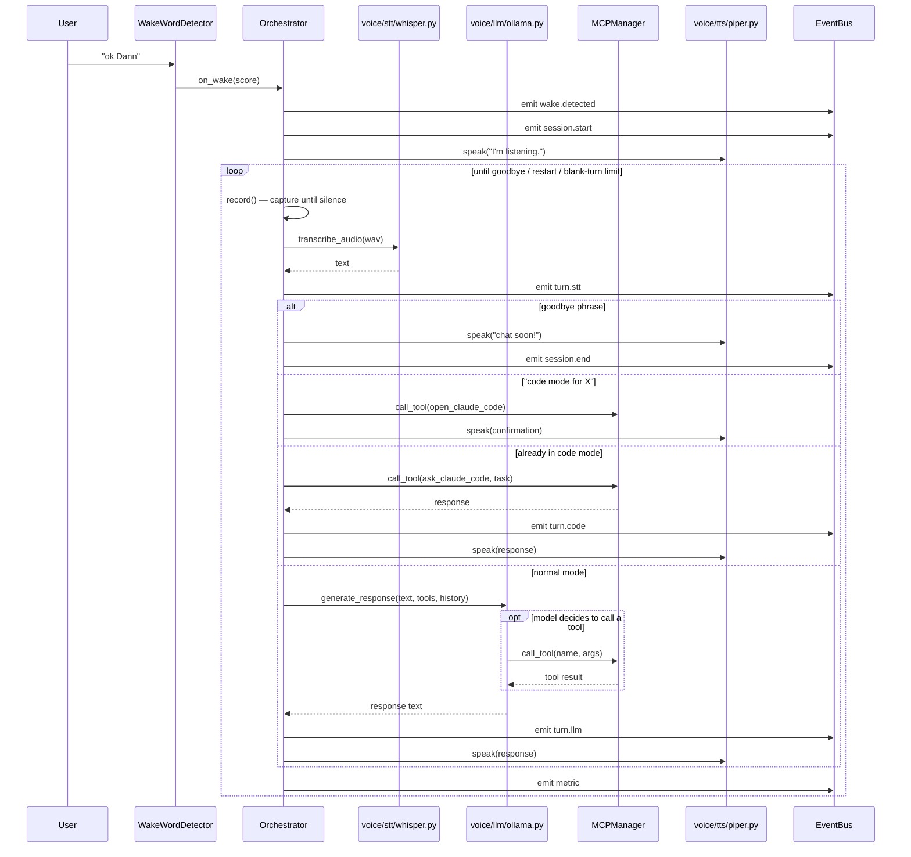
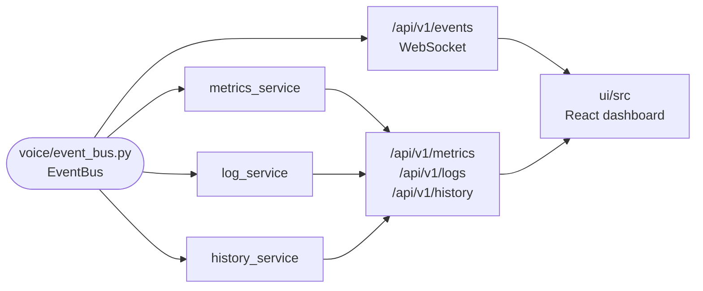

# Dann of Thursday


Voice AI agent: say **"ok Dann"** to ask questions. Uses wake word → STT (faster-whisper) → Ollama → Piper TTS.

## What this is

Dann is a **local-first** voice assistant. Every stage of the pipeline —
wake word detection, transcription, reasoning, speech synthesis — runs on
this machine. Nothing leaves it unless a question is explicitly routed to
Claude (local Ollama models handle most turns).

On top of that voice loop sits a FastAPI backend + React dashboard that
mirrors the pipeline's state live, and an MCP bridge that lets Dann drive
an actual Claude Code session — so "ok Dann, open Claude Code in \<project\>"
hands off a spoken conversation to a real coding agent.

For a full breakdown of languages, libraries, and *why* each one was
chosen, see [docs/tech-spec.md](docs/tech-spec.md). This section covers how the
pieces fit together at runtime.

## How it works

### The voice pipeline

```
"ok Dann" ─▶ wake word ─▶ record ─▶ STT ─▶ LLM router ─▶ TTS ─▶ speak
             Porcupine/     mic     faster-  Ollama         Piper  speaker
             openWakeWord           whisper  (local)         local
```

`voice/orchestrator.py` drives this loop. On each turn:

1. The wake word detector (`voice/wakeword/`) listens to a live mic stream
   and only wakes the rest of the pipeline once it hears "ok Dann" —
   everything downstream is comparatively expensive, so this gate matters.
2. `voice/audio/capture.py` records until silence (or a max duration), then
   `voice/stt/whisper.py` (faster-whisper) transcribes it locally.
3. The transcript goes to `voice/llm/ollama.py`, which calls a local Ollama
   model running under a **routing system prompt** (`config.yaml`'s
   `ollama.system_prompt`, extended at runtime with the `agents:` list —
   see `shared/agents_config.py`). The model decides per-turn whether to
   answer directly, or call a tool for the picked agent, e.g.:
   - `ask_claude` — hands complex/broad questions to the Claude API instead
     of the local model.
   - `ask_claude_code` / `open_claude_code` — routes project-specific
     questions, or an explicit request to start coding, to Claude Code via
     MCP (`integrations/client.py`, `integrations/servers/claude_code_server.py`).
   - `list_projects` — reads the `projects` list out of `config.yaml`.
4. The response text is synthesized by `voice/tts/piper.py` and played back
   through `voice/audio/playback.py`.

Every step emits an event onto `voice/event_bus.py` — that's what the
dashboard subscribes to, and what makes "watch Dann think" possible.

### Code mode

Saying something like "open Claude Code in \<project\>" flips the session
into `SessionMode.CODE` (see `voice/orchestrator.py`): Ollama routing is
bypassed entirely, conversation history resets, and every subsequent turn
goes straight to Claude Code over MCP until you say a goodbye phrase or ask
to exit code mode. This is the mechanism behind treating Dann as a voice
front-end for an agentic coding session rather than just a Q&A assistant.

### The dashboard

`app/main.py` runs a FastAPI backend that either (a) starts the voice
orchestrator in a background thread and shares its `EventBus`, or (b) runs
standalone with `NO_VOICE=1` for UI development without audio hardware.
Three services subscribe to the event bus and persist what they see:
`metrics_service` (turn latency/counts), `log_service` (structured logs),
`history_service` (conversation history) — all exposed over REST + a
WebSocket event stream to the `ui/` React app, which renders live pipeline
state, project panels, terminal output, and metrics. See
[docs/ui-spec.md](docs/ui-spec.md) for the dashboard's detailed spec.

## Code tour

New to this codebase? The diagrams below trace how the pieces actually call
each other, and the reading order at the end is the fastest path to a full
mental model.

### Module map



### One voice turn, end to end

This is what happens between "ok Dann" and Dann speaking back — the core
loop in `voice/orchestrator.py`'s `_run_session()` / `_run_turn()`.



`SessionMode.CODE` (the middle two branches above) is what "open Claude Code
in \<project\>" switches into — Ollama is bypassed entirely until you say a
goodbye phrase or ask to exit code mode.

### How the dashboard sees it live



`app/main.py`'s startup hook subscribes all three services to the same
`EventBus` the orchestrator emits to — so every `bus.emit(...)` call in
`orchestrator.py` is simultaneously a log line, a metric, a history entry,
and a WebSocket push, with no extra plumbing per feature.

### Suggested reading order

1. **This README** + [docs/tech-spec.md](docs/tech-spec.md) — orientation, and *why* each library was chosen.
2. **`voice/orchestrator.py`** — the state machine everything else plugs into. Start at `run()`, then `_run_session()`, then `_run_turn()`.
3. **`voice/wakeword/`, `voice/audio/`, `voice/stt/whisper.py`, `voice/tts/piper.py`** — the four pipeline stages the orchestrator calls into, in call order.
4. **`voice/llm/ollama.py`** + **`shared/agents_config.py`** — how the routing system prompt is built and how tool-calling works.
5. **`integrations/client.py`** (`MCPManager`) + **`integrations/servers/*.py`** — how tools are actually implemented, and the `list_modules`/`enable_module`/`disable_module` lifecycle.
6. **`voice/event_bus.py`** — the pub/sub backbone; then look at who subscribes (`app/services/*_service.py`) to see it from the consumer side.
7. **`app/main.py`** — how the FastAPI backend boots, shares the orchestrator's `EventBus`, and starts the shared MCP manager independently of voice (`NO_VOICE=1`).
8. **`app/api/v1/router.py`** + **`app/api/v1/endpoints/*.py`** — the REST/WebSocket surface, one file per resource.
9. **`app/services/*.py`** — the persistence/business logic behind each endpoint (matches 1:1 with the endpoints in most cases).
10. **`ui/src/hooks/useDannEvents.ts`** and **`useDannState.ts`** — the WebSocket client and Zustand store the whole dashboard reads from, then **`ui/src/components/`**.

`tests/` mirrors this same domain split (`tests/voice/`, `tests/integrations/`,
etc.) — a good way to confirm your understanding of a module is to read its
tests right after the module itself.

## Project layout

```
voice/          Voice pipeline (wake word → STT → LLM → TTS)
integrations/   MCP client + tool-server modules (projects, schedule, notes, gardening, bjj, devteam, system)
shared/         Cross-cutting code used by both voice/ and app/ (agent routing config, restart)
app/            FastAPI backend + API (serves dashboard state, REST, WebSocket)
ui/             React + Tailwind dashboard (Vite dev server / optional Electron)
models/         Wake word models, Piper voice, openwakeword submodule
scripts/        Guided setup (scripts/setup.sh), workstation bootstrap, wake-word tooling (scripts/wakeword/)
deploy/         Cloudflare Tunnel + launchd templates for remote access
docs/           Design/tech-spec/UI-spec docs and setup notes
config.yaml     Runtime config (audio, STT, TTS, wake word, Ollama, agents, MCP servers)
```

## Setup (macOS)

Guided setup (recommended) — walks through each pipeline stage, explains
what it's for, and only touches things you confirm:

```bash
bash scripts/setup.sh
```

Or manually:

```bash
python3 -m venv .venv
source .venv/bin/activate
pip install -r requirements.txt
cp config.example.yaml config.yaml
```

1. **Wake word model**: 
   - Get a free AccessKey from https://console.picovoice.ai/
   - Create custom wake word "ok Dann" in Picovoice Console
   - Download the `.ppn` model file to `models/ok_dann.ppn`
   - Set `wake_word.access_key` in `config.yaml` (see [docs/wake-word.md](docs/wake-word.md))
2. **Ollama**: Install and run `ollama serve`, pull a model (e.g. `ollama pull llama3.2`).
3. **Piper TTS**: Included via `pip install piper-tts` (works on M1). Download a voice from [Piper voices](https://github.com/rhasspy/piper/releases) (e.g. `en_US-lessac-medium.onnx`), place in `models/piper/`, set `tts.voice_model` in config.

Edit `config.yaml` for your paths and preferences.

## Run

```bash
source .venv/bin/activate
python -m voice.main
```

Say "ok Dann" then ask your question.

### Dashboard

The backend and voice pipeline share one process by default — starting the
API also starts the orchestrator. To develop the dashboard without a mic:

```bash
NO_VOICE=1 .venv/bin/uvicorn app.main:app --host 0.0.0.0 --port 8000
cd ui && npm install && npm run dev   # http://localhost:3000, proxies to :8000
```

With voice enabled (`NO_VOICE` unset), the same backend command also runs
the orchestrator, so `http://localhost:8000` and the OpenAPI docs at
`/docs` are live alongside the mic pipeline. See "How it works" above for
what the dashboard is actually showing you.

## Local AI Workstation

The vision: this Mac runs a set of AI/dev services — Dann's voice pipeline
and dashboard, a browser-based code editor, a notebook server, a file
manager — that are usable both **locally at the machine** and **remotely
from any browser**, without exposing an open port on your router or
running a password-less service on the public internet.

### Network model: Cloudflare Tunnel + Access

```
 Browser (anywhere)                     This Mac
┌──────────────────┐   HTTPS      ┌───────────────────────────────┐
│ dann.yourdomain   │─────────────▶│  Cloudflare Access             │
│ code.yourdomain   │   (edge      │  (OAuth login: Google/GitHub,  │
│ notebook.yourdomain│   auth)     │   per-hostname policy)         │
│ files.yourdomain  │              └───────────────┬─────────────────┘
└──────────────────┘                               │ outbound-only
                                                     │ tunnel (cloudflared)
                                     ┌───────────────▼─────────────────┐
                                     │  cloudflared  (ingress routing)  │
                                     ├──────────┬──────────┬───────────┤
                                     │ :8000     │ :8080    │ :8888 :8081│
                                     │ Dann API  │ code-    │ Jupyter,   │
                                     │ + UI      │ server   │ filebrowser│
                                     └──────────┴──────────┴───────────┘
```

- **cloudflared** runs on this Mac and opens an *outbound* connection to
  Cloudflare — no inbound port forwarding, no static IP, no router
  changes, no self-managed TLS cert.
- **Cloudflare Access** sits in front of every public hostname and
  requires an OAuth login (Google/GitHub, or whatever identity provider
  you connect) before a request is even forwarded to this machine. This
  is the real auth boundary — it protects `terminals`, `runs`, `mcp`, and
  `tools` endpoints that can execute code on this box, so every hostname
  must have an Access policy before it's routed.
- Local services still bind to `127.0.0.1`/`localhost` only — they are
  never directly reachable from the LAN or internet, only through the
  tunnel. On the machine itself, use `http://localhost:<port>` as today.
- `app/core/cf_access.py` adds an optional second check inside the
  FastAPI app (`CF_ACCESS_ENABLED=true`) that verifies the Access JWT
  itself. This is defense-in-depth for cases where a request reaches
  uvicorn without going through the tunnel (e.g. over Tailscale or LAN)
  — Access at the edge is the primary control either way.

**Prerequisite:** a domain added to Cloudflare (their nameservers) — any
domain you own, or a cheap one bought through Cloudflare or another
registrar and pointed at Cloudflare's nameservers. Cloudflare Tunnel and
Access are free for personal/small-team use.

### Services

| Service | Local port | Purpose |
|---|---|---|
| Dann API + dashboard | 8000 | Voice pipeline state, chat, terminals, project runs |
| code-server | 8080 | VS Code in the browser, for editing this or other projects remotely |
| JupyterLab | 8888 | Notebook environment for experimentation |
| filebrowser | 8081 | Browse/upload/download files on this machine |
| Ollama | 11434 | LLM inference backend — kept **internal only**, not routed through the tunnel; only Dann's backend talks to it |

### Setup

1. `bash scripts/setup_workstation.sh` — installs `cloudflared`,
   `code-server`, `filebrowser`, and `jupyterlab` via Homebrew/pip.
   Review the script before running it.
2. Authenticate and create the tunnel:
   ```bash
   cloudflared tunnel login
   cloudflared tunnel create dann-workstation
   cp deploy/cloudflared/config.yml.example deploy/cloudflared/config.yml
   # fill in the tunnel id from `tunnel create` and your hostnames
   cloudflared tunnel route dns dann-workstation dann.yourdomain.com
   cloudflared tunnel route dns dann-workstation code.yourdomain.com
   cloudflared tunnel route dns dann-workstation notebook.yourdomain.com
   cloudflared tunnel route dns dann-workstation files.yourdomain.com
   ```
3. In the [Cloudflare Zero Trust dashboard](https://one.dash.cloudflare.com/)
   → Access → Applications, create one application per hostname above,
   each with a policy requiring login via your chosen identity provider
   (Google/GitHub). Without this step the tunnel is unauthenticated.
4. Copy `.env.example` to `.env` and set `BACKEND_CORS_ORIGINS` to include
   your public hostnames, plus `CF_ACCESS_ENABLED`/`CF_ACCESS_TEAM_DOMAIN`/
   `CF_ACCESS_AUD` if you want the defense-in-depth JWT check.
5. Install the launchd services so everything survives reboots/logout:
   ```bash
   for f in deploy/launchd/*.plist; do
     sed "s#__REPO_PATH__#$(pwd)#g" "$f" > ~/Library/LaunchAgents/$(basename "$f")
   done
   launchctl load ~/Library/LaunchAgents/com.dannofthursday.backend.plist
   launchctl load ~/Library/LaunchAgents/com.dannofthursday.cloudflared.plist
   ```
6. Start code-server / JupyterLab / filebrowser bound to `127.0.0.1` (see
   the end of `scripts/setup_workstation.sh` for the exact commands), and
   optionally wrap those in their own launchd plists using the two in
   `deploy/launchd/` as a template.

### Security notes

- Every hostname routed through `cloudflared` **must** have a Cloudflare
  Access policy before you consider it live — the tunnel itself does not
  authenticate anyone.
- Ollama and any other purely-local tool should stay off the tunnel's
  ingress list entirely; only proxy what genuinely needs remote access.
- `.env`, `deploy/cloudflared/config.yml`, and the `*.json` tunnel
  credentials file are gitignored — never commit them.
- Because Dann's `terminals`/`runs`/`mcp` endpoints can execute arbitrary
  commands on this machine, treat the Access login as equivalent to a
  login to the machine itself when deciding who gets access.
